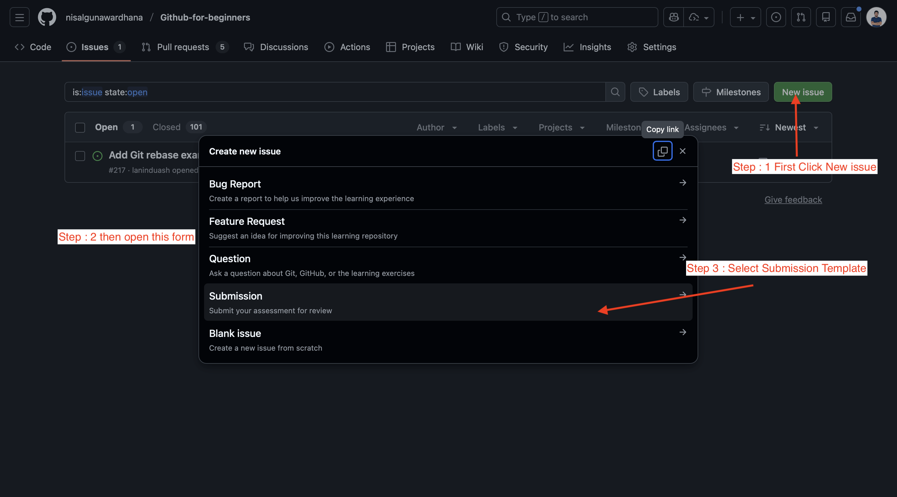
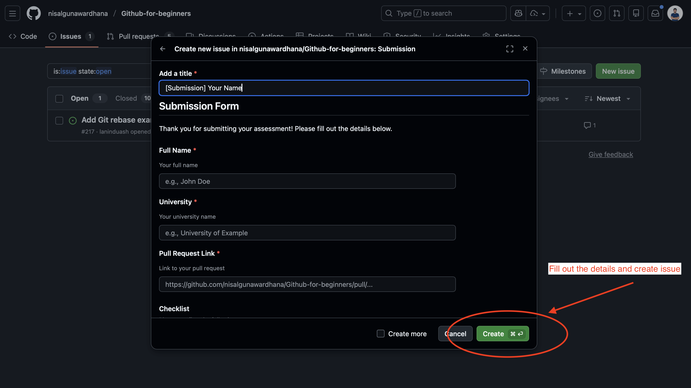

# 🚀 GitHub 101 - GitHub For Beginners

Welcome to the **GitHub for Beginners** practice repository! This repo is designed to help you learn and practice essential GitHub workflows including forking, cloning, branching, committing, pushing, and creating pull requests.

<p align="center">
    
</p>

[](https://github.com/nisalgunawardhana)
[](https://github.com/nisalgunawardhana/Github-for-beginners/stargazers)

## 📌 About This Repository

**Target Audience:** Absolute beginners looking to learn Git and GitHub fundamentals  
**Difficulty Level:** Beginner 🟢  
**Estimated Time to Complete:** 30-45 minutes  
**Last Updated:** January 30, 2026

This repository provides hands-on practice with real GitHub workflows and is perfect for:
- 👨‍💻 First-time Git users
- 🎓 Students learning version control
- 🚀 Career changers entering tech
- 👥 Teams onboarding new developers
## 📋 What You'll Learn

By completing this practice repository, you'll gain hands-on experience with:

- ✅ **Fork a repository** - Create your own copy on GitHub
- ✅ **Clone a repository** - Download to your local machine
- ✅ **Create and switch between branches** - Organize your work
- ✅ **Make changes to files** - Edit code and content
- ✅ **Stage and commit changes** - Save your work with messages
- ✅ **Push changes to GitHub** - Upload to remote repository
- ✅ **Create Pull Requests** - Propose changes to projects
- ✅ **Work with Issues** - Manage tasks and track bugs
- ✅ **Basic Git commands** - Master essential CLI tools
- ✅ **GitHub workflow fundamentals** - Understand collaborative development

## Prerequisites

Before you begin, make sure you have the following installed. For detailed installation instructions, see [Prerequisites – GitHub 101 (For Beginners).pdf](docs/Prerequisites%20–%20GitHub%20101%20(For%20Beginners).pdf)

### 1. Install Git

#### For Windows:
1. Download Git from [git-scm.com](https://git-scm.com/download/win)
2. Run the installer and follow the setup wizard
3. Use the default settings (recommended for beginners)
4. Verify installation by opening Command Prompt or PowerShell:
    ```bash
    git --version
    ```

#### For Mac:
1. Install via Homebrew (recommended):
    ```bash
    brew install git
    ```
    Or download from [git-scm.com](https://git-scm.com/download/mac)
2. Verify installation in Terminal:
    ```bash
    git --version
    ```

### 2. Install Visual Studio Code
1. Download VS Code from [code.visualstudio.com](https://code.visualstudio.com/)
2. Install the application for your operating system
3. Install the [VS Code command line tool](https://code.visualstudio.com/docs/editor/command-line) to open projects from terminal


## 🎯 Getting Started

### Step 1: Fork This Repository
1. Click the **"Fork"** button at the top right of this repository
2. This creates a copy of the repository under your GitHub account
3. You'll now have full control to make changes without affecting the original

### Step 2: Clone Your Fork
```bash
# Replace 'your-username' with your actual GitHub username
git clone https://github.com/your-username/Github-for-beginners.git

# Navigate to the project directory
cd Github-for-beginners
```
> 💡 **Tip:** To open the project in VS Code from your terminal, run:
> 
> ```bash
> code .
> ```
> Make sure you have the [VS Code command line tool](https://code.visualstudio.com/docs/editor/command-line) installed.

### Step 3: Configure Your Identity (First Time Only)
```bash
# Set your Git username (use your GitHub username)
git config --global user.name "Your Name"

# Set your Git email (use the email associated with your GitHub account)
git config --global user.email "your.email@example.com"

# Verify configuration
git config --list
```

## 📁 Repository Structure

```
Github-for-beginners/
├── README.md                          # This file - start here!
├── LICENSE                            # MIT License information
├── CONTRIBUTING.md                    # Guidelines for contributing
├── git-commands-reference.md          # Quick Git command reference
├── practice-file.md                   # Practice file for edits
├── student-introductions.md           # Add your introduction here
├── docs/                              # Documentation and guides
│   └── Prerequisites...pdf            # Setup instructions
├── images/                            # Instructional images
│   ├── banner.png
│   ├── pr-image1.png
│   ├── pr-image2.png
│   ├── pr-image3.png
│   ├── issue1.png
│   └── issue2.png
└── student-opportunities/             # Additional learning resources
    └── README.md
```

**Key Files to Know:**
- **`student-introductions.md`** - Where you'll add your first contribution
- **`practice-file.md`** - Safe space to practice making changes
- **`git-commands-reference.md`** - Quick lookup for Git commands

## 🎓 Branch Practice Exercises

Complete the following exercises in order. Each one builds on the previous step and introduces new Git concepts.

### Exercise 1: Create Your First Branch
```bash
# Create and switch to a new branch with your name
git checkout -b feature/your-name-introduction

# Or alternatively (two-step approach)
git branch feature/your-name-introduction
git checkout feature/your-name-introduction

# Verify you're on the new branch (should show your branch name)
git branch
```
**What's happening:** You're creating an isolated space to work without affecting the main codebase.

### Exercise 2: Make Your First Changes
1. Open the `student-introductions.md` file
2. Add your introduction following the template provided
3. Include your name, GitHub username, and a brief bio (2-3 sentences)
4. Save the file when complete

**Tip:** You can also practice with `practice-file.md` to experiment without affecting the main file.

### Exercise 3: Stage and Commit Changes
```bash
# Check what files have changed (shows modified files in red)
git status

# Add your changes to staging area
git add student-introductions.md

# Or add all changes at once
git add .

# Commit your changes with a descriptive message
git commit -m "Add introduction for [Your Name]"

# View your commit in the history
git log --oneline -n 5
```
**What's happening:** You're creating a "snapshot" of your changes with a message describing what you did.

### Exercise 4: Push Your Branch
```bash
# Push your branch to your fork on GitHub
git push origin feature/your-name-introduction

# Verify push was successful (you'll see branch name in output)
git branch -vv
```
**Note:** If this is your first push, GitHub may require authentication. Follow the prompts to set up SSH or use a personal access token.

**What's happening:** You're uploading your branch and changes to your GitHub fork so it's available online.

### Exercise 5: Create a Pull Request
1. Go to your fork on GitHub (github.com/your-username/Github-for-beginners)
2. You'll see a prompt to create a Pull Request (or switch to your branch and click "Compare & pull request")
3. Add a clear title: `"Add [Your Name] introduction"`
4. In the description, write:
   - What you've added
   - Why you're making this change
   - Any relevant links or references
5. Click **"Create pull request"**
6. Wait for the maintainers to review your changes!

**What's happening:** You're proposing your changes to the original project. The maintainers can review, discuss, and merge your work.

<p align="center">
    
</p>
<p align="center">
    
</p>
<p align="center">
    
</p>


## 🏆 Submission Guidelines

After you've completed the exercises and your pull request has been merged, track your achievement by creating an issue in the **original repository**:

1. **Go to the main repository** (nisalgunawardhana/Github-for-beginners)
2. **Click the Issues tab** and select **New Issue**
3. **Use the "Submission" template** and include:
    - ✅ Your GitHub username
    - ✅ Link to your pull request
    - ✅ Screenshot of your contribution
    - ✅ What branch did you create?
    - ✅ Brief reflection: What was one thing you learned?
    - ✅ Any challenges you faced and how you overcame them

**Tip:** Don't wait for approval to create the issue. Create it when you submit your pull request!

<p align="center">
    
</p>
<p align="center">
    
</p>

## 📋 Checklist for Completion

- [ ] Successfully forked the repository
- [ ] Cloned to local machine
- [ ] Created at least 2 different branches
- [ ] Made commits with good commit messages
- [ ] Pushed branches to GitHub
- [ ] Created at least 1 pull request
- [ ] Created at least 1 issue on the main repository
- [ ] Added your introduction to the student introductions file


## 🐛 Working with Issues

### Creating an Issue
1. Go to the **Issues** tab
2. Click **"New issue"**
3. Choose from our templates:
   - Bug Report
   - Feature Request
   - Question
   - Submission 

### Issue Best Practices
- Use descriptive titles
- Provide detailed descriptions
- Add relevant labels
- Reference related issues or PRs using #number

## 🔄 Common Git Commands Reference

### Basic Commands
```bash
# Check repository status
git status

# View commit history
git log --oneline

# Check current branch
git branch

# Switch branches
git checkout branch-name

# Create and switch to new branch
git checkout -b new-branch-name

# Delete a branch
git branch -d branch-name
```

### Working with Changes
```bash
# Add specific files
git add filename.txt

# Add all changes
git add .

# Commit with message
git commit -m "Your commit message"

# Add and commit in one step
git commit -am "Your commit message"
```

### Synchronizing with Remote
```bash
# Push changes
git push origin branch-name

# Pull latest changes
git pull origin main

# Fetch updates without merging
git fetch upstream
```

## 🤝 Contributing

This is a learning repository, and contributions are welcome! If you have suggestions for improvement:

1. Create an issue to discuss your idea
2. Fork the repository
3. Create a feature branch
4. Make your changes
5. Submit a pull request

## 📚 Additional Resources

- [Git Documentation](https://git-scm.com/doc)
- [GitHub Guides](https://guides.github.com/)
- [Interactive Git Tutorial](https://learngitbranching.js.org/)
- [GitHub Flow](https://guides.github.com/introduction/flow/)

## 📞 Need Help?

- Create an issue with the "Question" template
- Check existing issues for similar questions
- Review the documentation links above

## ⚖️ License

This project is licensed under the MIT License - see the [LICENSE](LICENSE) file for details.

---

## 🌐 Connect with Me

Follow me on social media for updates and more learning resources:

[](https://twitter.com/thenisals)
[](https://linkedin.com/in/nisalgunawardhana)
[](https://instagram.com/thenisals)

**Happy Learning! 🎉**

Remember: Making mistakes is part of learning. Don't be afraid to experiment and try new things!
