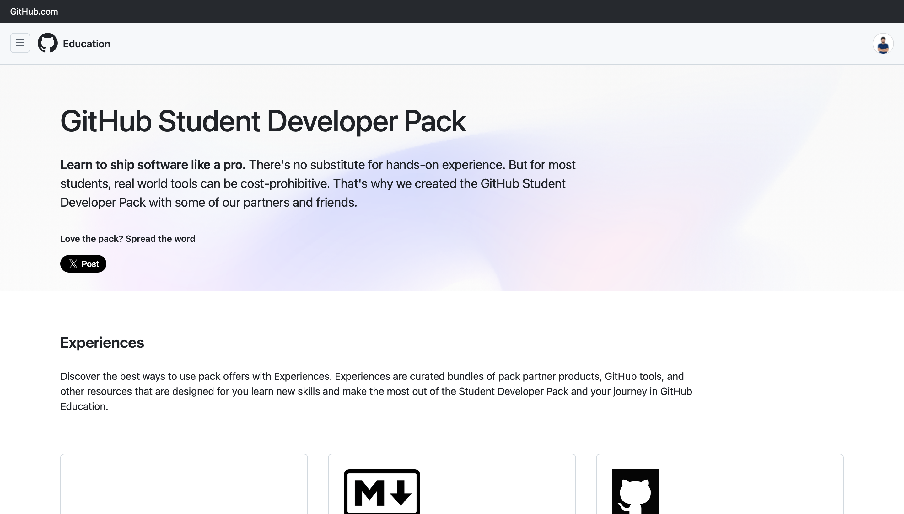
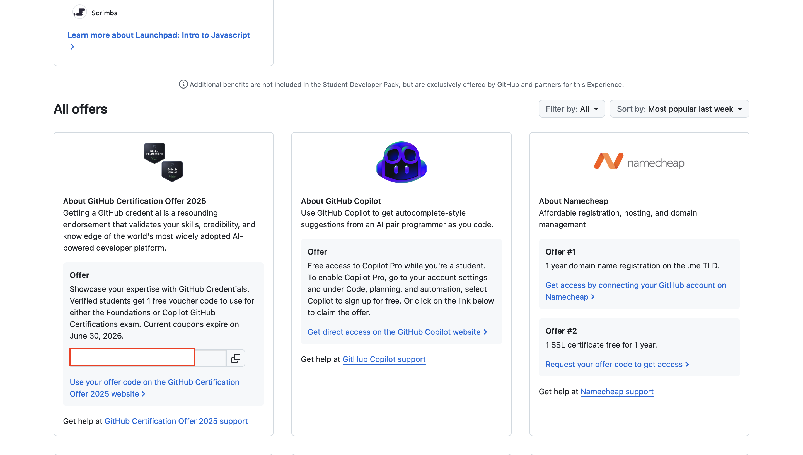
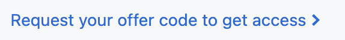

# GitHub Student Certification Voucher (Foundations or Copilot)

This document explains how verified students can request and use the GitHub certification voucher included in the Student Developer Pack. The voucher is valid for one exam attempt and can be applied to either the Foundations Exam or the Copilot Exam (not both).

## Important details

- Voucher window: the 2025–2026 vouchers expire on 2026-06-30.
- Usage: each voucher can be used once.
- Exam choice: voucher is valid for either the Foundations Exam or the Copilot Exam (not both).
- Certification records: certifications earned through PSI (before 2025-07-01) remain on GitHub Learn. Certifications earned through Pearson VUE (on or after 2025-07-01) will appear on Microsoft Learn.
- Badges: current exams issue badges through Microsoft Learn (not Credly).
- Rescheduling: cancel or reschedule at least 24 hours before the appointment to avoid forfeiting fees.

## How to request a voucher

1. Verify your student status on GitHub if you are not already verified. See this discussion for guidance: https://github.com/orgs/community/discussions/156395
2. Visit the Student Developer Pack page: https://education.github.com/pack
3. Locate the Certification offer tile and click the link to request your offer code.
4. Follow the on-screen instructions to receive your voucher code.

## Screenshots

If you include the `images/` folder in this repository, the screenshots referenced below should render in Markdown viewers. Example image references (update filenames if different):

## Scheduling and taking an exam

1. Visit GitHub Learn and open the Credentials section.
2. On the Credentials page, find either the Foundations or Copilot exam and choose the one you want to take.
3. On the exam page, click Schedule Now. You will be redirected to the Microsoft Learn scheduling flow (Pearson VUE may be used to deliver the exam).
4. On the Microsoft Learn (or Pearson VUE) page you can review learning paths, pricing, practice exams, and the exam sandbox. Click Schedule exam when you are ready.
5. When prompted for payment or voucher code, enter your voucher code to apply it to the exam fee.

## More information

For additional details about scheduling and any changes to the certification delivery, see the community discussion: https://github.com/orgs/community/discussions/165477

If you want, I can also:
- Proofread and simplify screenshot captions.
- Add alt text and smaller image sizes for web readability.

