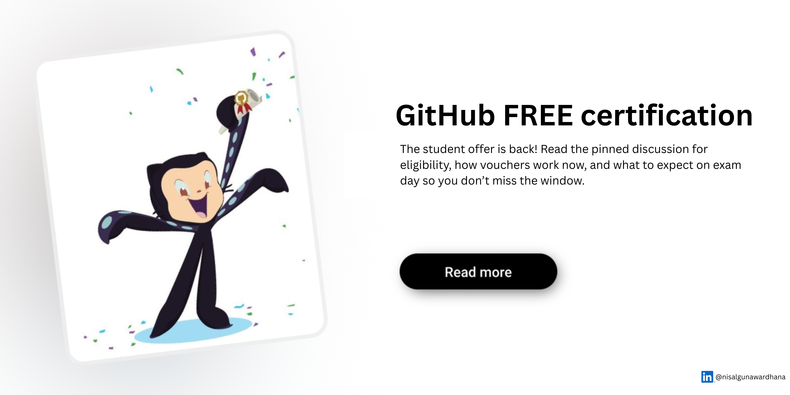

# 🎓 Student Opportunities - GitHub Certifications

  

## 🚀 GitHub Certification Vouchers for Students

**Updated: September 30, 2025**

---

## 🎉 **EXCITING NEWS: GitHub Student Vouchers Are Back!**

The student voucher for GitHub certifications returns to the **Student Developer Pack** on **Tuesday, September 30, at 1pm EST**. We're thrilled to be able to expand on our offer from last year!

### 🆕 What's New This Year?
The voucher can now be used for **EITHER** the **Foundations exam OR the Copilot exam** - giving you more flexibility in your learning journey!

---

## 📋 **IMPORTANT INFORMATION - READ FIRST!**

### ⚠️ **Critical Details:**

- **Expiration Date:** The 2025-2026 vouchers expire on **June 30, 2026**
- **Usage Limit:** The voucher can be used **1 time only**
- **Exam Options:** Voucher is valid for **either** the Foundations Exam **OR** the Copilot Exam. **Not both.**
- **Badge System:** The current exam earns a badge through **Microsoft Learn** NOT a Credly badge
- **Rescheduling Policy:** Be sure to reschedule or cancel exam appointments **at least 24 hours** before your scheduled exam or your fee will be forfeited

### 🔄 **System Changes:**
GitHub has moved to a different system: **Microsoft Learn and Pearson VUE** to deliver the exams.

### 📜 **Certification History:**
- **Pre-July 1, 2025:** All certifications earned through PSI will remain visible in your **GitHub Learn profile**
- **Post-July 1, 2025:** All certifications earned through Pearson VUE will appear in your **Microsoft Learn profile**

---

## 🎯 **Available Certifications**

### 1. 🏗️ **GitHub Foundations Exam**

**Perfect for beginners!** This exam covers:
- Git and GitHub basics
- Repository management
- Collaboration workflows
- GitHub features and tools

### 2. 🤖 **GitHub Copilot Exam**

**For AI-powered development!** This exam covers:
- GitHub Copilot fundamentals
- AI-assisted coding
- Best practices for AI pair programming
- Productivity optimization with Copilot

---

## 🚀 **How to Get Started**

To claim your GitHub certification voucher, visit the official discussion thread: [GitHub Student Certification Voucher Claim](https://github.com/orgs/community/discussions/165477#discussion-8556274). Here, you'll find instructions on eligibility, how to request your voucher, and answers to common questions. Make sure to read the guidelines carefully before submitting your claim.

---
### 🎥 **Learning Materials**
- [GitHub Copilot](https://learn.microsoft.com/en-us/training/paths/copilot/)
- [Microsoft Learn - GitHub Foundations ](https://learn.microsoft.com/en-us/collections/o1njfe825p602p)

---

## 💡 **Pro Tips for Success**

- 🎯 **Choose Wisely:** Pick the exam that aligns with your current skill level and career goals
- 📅 **Plan Ahead:** Don't wait until the last minute - vouchers expire June 30, 2026
- 📚 **Study Thoroughly:** Use all available resources and practice regularly
- ⏰ **Schedule Smart:** Book your exam when you're most prepared, but remember the cancellation policy
- 🤝 **Get Support:** Join our community discussions for study tips and motivation

---

## 🌐 Connect with Me

Follow me on social media for updates and more learning resources:

## 📄 **Disclaimer**

This information is based on the GitHub Student Developer Pack announcement dated September 30, 2025. Details may change. Always refer to the official GitHub Education website for the most current information.

---

**Good luck with your GitHub certification journey! 🎉**

*Last updated: September 30, 2025*

