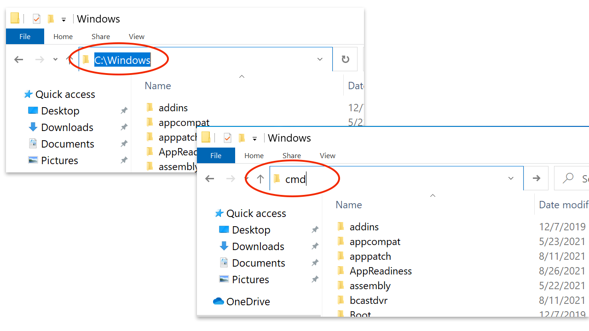

## How To Open Command Prompt in a Folder (Open Folder in CMD)

You're working in File Explorer. You want to open CMD in the current folder.

To open a folder in cmd, click on the address bar (highlight the File Explorer address bar), type `cmd`, and press Enter.

Once you press the enter key, a new command prompt window will be open. In the command prompt, run the `cd` command to check the current working directory.

Using the same method, you can also open a PowerShell window in a folder. Type `PowerShell` in the address bar and press Enter.

This method works on any Windows OS computer, including Windows 10, 11, and Windows Server.

Example image:

